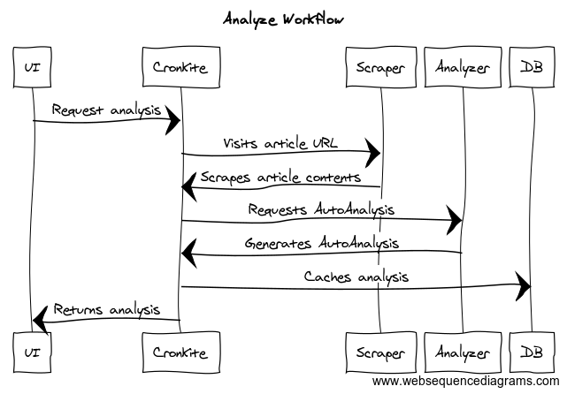

# contributing

## architecture

the core value proposition of informed-citizen is encapsulated the analysis workflow:

`cronkite` is the core API and serves the ui application assets.  other services can be referenced in the docker-compose file in the root of the project.

## getting started

### pre-reqs

install:

- nodejs 10.+
- docker, 18.*
- yarn, latest

this project houses multiple artifacts.  at the time of writing:

1. a webservice, `cronkite`
2. a common library, sharing functionality between the ui & webserver
3. _tbd_ ~a ui application~

see the `packages/` folder for individual project sources.

this project uses [lerna](https://www.npmjs.com/package/lerna) to link the dependent projects together, so co-development may occur.

### installation

- ensure `NODE_ENV` is set in your environment.  e.g. `echo NODE_ENV=development >> ~/.bashrc && . ~/.bashrc`
- cd `/path/to/project`
- `yarn bootstrap` to install and link all child project dependencies
  - **never `yarn add <thing>`** into a project directly, unless you know what you are doing.  it's advisable to add dependencies to the relevant package.json and run `yarn bootstrap` again from the root project.  this ensures that all links remain intact between packages!
- `yarn build` to compile all sub projects.

### configuration

- add `ENV` variables to a `informed.env` file, using `informed.env.example` as the guiding template

## run

  - trust the dev cert at `./reverse-proxy/sercurity/cert.pem`
  - `yarn start:services` to start required services (scraper, analyzer, database, dev-only reverse-proxy),
  - `cd packages/cronkite` & `yarn start` to:
    - launch the api,
    - migrate the db
    - serve thi isomorphicjs ui app

edit freely.

### troubleshooting

- if you see a `ENOSPC` error on linux, consider [this remedy](https://stackoverflow.com/a/17437601/1438908).

## develop

### general

- VSCode users can benefit from the multi-package project by opening `project.code-workspace`
  - e.g. `code project.code-workspace`
  - this enables all of the [VSCode workspace radness](https://code.visualstudio.com/docs/editor/multi-root-workspaces)

## test

see packages

## lint

all code is autoformatted using `prettier-standard` for an opinionated, rigid style
