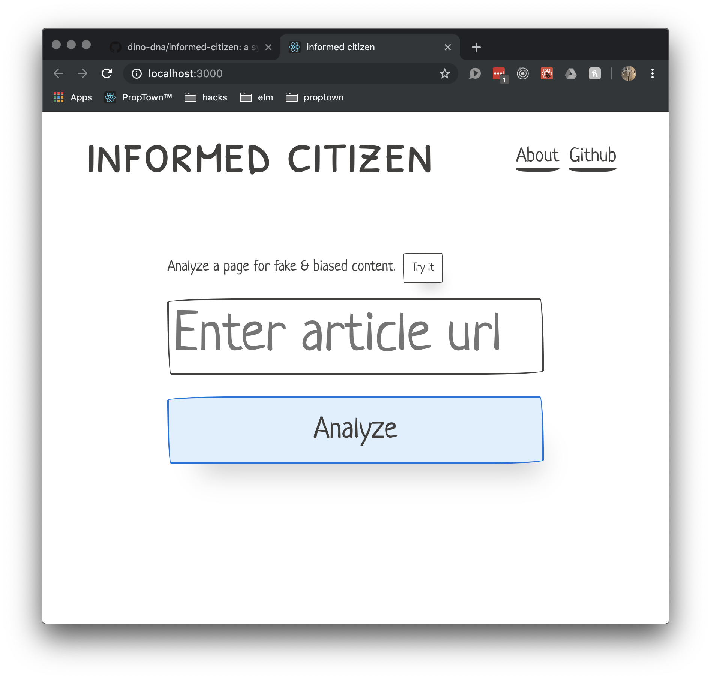

# informed-citizen

a system to keep citizens informed as they graze the airwaves

  

## why

platforms are too afraid to regulate hate & general incivility because they are [nervous it makes them
look partisan](https://motherboard.vice.com/en_us/article/a3xgq5/why-wont-twitter-treat-white-supremacy-like-isis-because-it-would-mean-banning-some-republican-politicians-too). they have complex rules that are loosely composed that dictates [what's ok and what's not](https://gizmodo.com/here-s-everything-that-s-banned-on-facebook-all-on-one-1825495383)
to post on their platform.

it's confusing, unsatisfactory, and insufficient.

regulation is not about suppression. it is about protection & safety, of which our greater internet ecosystem badly needs.

## contributing

to learn how develop and contribute, see [contributing.md](./.github/contributing.md)
